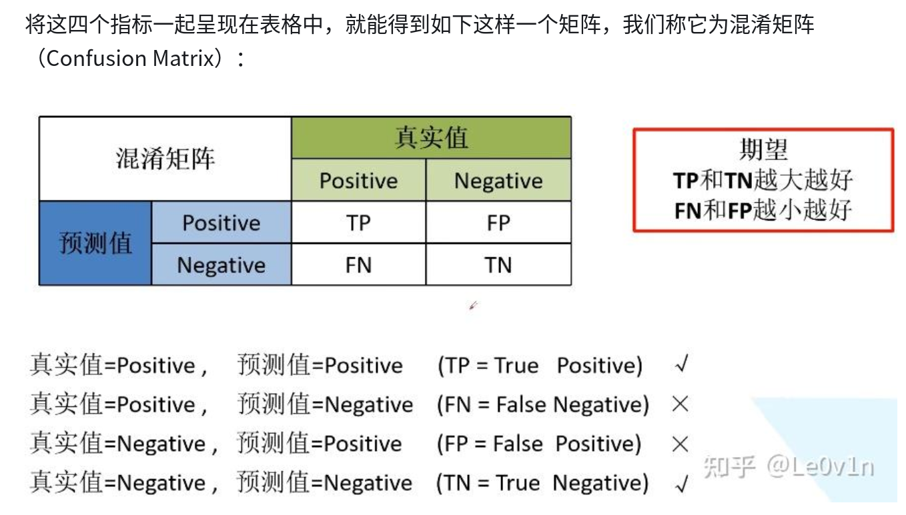
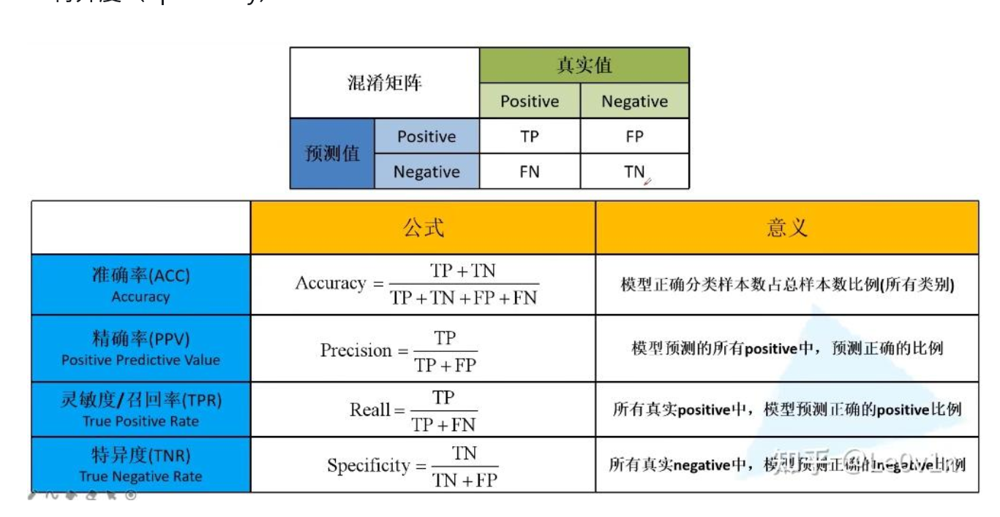

# 模型评估——混淆矩阵

## 基本概念

TP、FP、TN、FN为混淆矩阵的4个重要指标

**我的理解：**
- TP： 正确地把物品判为了正样本(True to positive)
- FP： 错误地把物品判为了正样本(False to positive)
- TN： 正确地把物品判为了负样本(True to negative)
- FN： 错误地把物品判为了正样本(False to positive)

**参考图：**


## 查全率与查准率

查准率
```math
p = \frac{TP}{TP + FP}
```

查全率
```math
R = \frac{TP}{TP + FN}
```

**参考图：**



## 参考文章

https://blog.csdn.net/dongjinkun/article/details/109899733  

https://zhuanlan.zhihu.com/p/503320556  